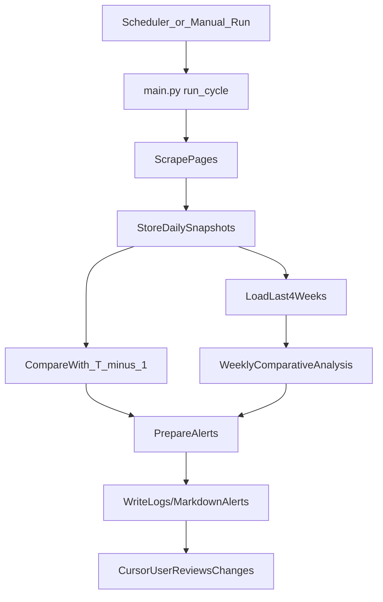

## Competitor Website Analyzer – High-Level Plan

### 1. Project initialization & structure (Prompt 1)

- **Create project layout**: Organize a new Python project with folders like `[project_root]/scraper`, `[project_root]/analysis`, `[project_root]/alerts`, and `[project_root]/data`.
- **Virtual environment**: Document using `python -m venv .venv` and activation steps for Windows PowerShell.
- **Dependency management**: Add a `requirements.txt` (e.g., `requests`, `beautifulsoup4`, `lxml`, `pydantic` or `dataclasses`, `schedule` or `APScheduler`, `python-dotenv` if needed).
- **Core entrypoints**: Plan a main CLI script `[project_root]/main.py` to run end‑to‑end: scrape → compare → alert.
- **Configuration file**: Add a simple config file (e.g., `config.yaml` or `config.json`) listing the three URLs, labels ("self", "HDFC", "IDFC"), and time zone/schedule info.

### 2. Scraper implementation & data capture (Prompt 2)

- **Browser and HTTP approach**: Prefer `requests + BeautifulSoup` scraping for HTML content; describe when to fall back to a headless browser if page content is rendered dynamically.
- **Page-specific extraction logic**: For each of the three target URLs, inspect DOM structure (manually / via browser) and design CSS/XPath selectors to extract:
  - **Features & benefits sections**
  - **ROI (interest rate) details**
  - **Charges/fees and other costs**
- **Screenshot capture design**: Explain how to capture screenshots of key sections (e.g., using browser or a scriptable tool like Playwright/Selenium) and decide file naming convention such as `screenshots/{bank}/{YYYY-MM-DD}.png`.
- **Data model**: Define a structured Python model (e.g., `LoanPageSnapshot`) with fields: date, lender_name, features (list of strings), benefits (list of strings), roi_details, charges_details, raw_html_snippet, and screenshot paths.
- **Storage format**: Save daily per-lender snapshots as JSON files in `[project_root]/data/{lender}/{YYYY-MM-DD}.json`, plus optional combined file per day for all lenders.
- **Scheduling intent**: In code comments or a helper script, define a function `run_daily_scrape()` and document how to wire it to Windows Task Scheduler at 12:30AM GMT+5:30.

### 3. Change detection & 4-week comparative analysis (Prompt 3)

- **Historical load**: Implement functions to load `T-1` snapshot(s) and latest snapshot(s) from `data/` by date and lender.
- **Field-wise diffing**: For features, benefits, ROI, and charges:
  - Compare text lists using set and diff operations.
  - Highlight added/removed items and text changes.
  - Normalize text (trim, lowercase, strip formatting) to avoid noisy diffs.
- **4-week window**: Implement helper to fetch up to the last 28 days of snapshots per lender, and compute weekly summaries:
  - Number of changes per category
  - Directional changes in ROI (e.g., "ROI decreased from X% to Y%")
  - Any new charges or waived fees.
- **Comparative report across lenders**: Build an `analysis/reporting.py` component to generate a textual report comparing your page vs HDFC vs IDFC for the requested date range (last 4 weeks), including:
  - Current values
  - Change history highlights per lender
  - Which lender is more aggressive on ROI or fees.
- **CLI interface**: Provide commands or flags (e.g., `python main.py analyze --since 28`) to generate and print/save the comparison report.

### 4. Alert/notification system inside Cursor (Prompt 4)

- **Change trigger**: In `analysis` layer, define a function `detect_significant_changes(today, yesterday)` that returns a structured summary of any differences.
- **Alert abstraction**: Implement an `alerts/notifier.py` with a simple interface like `send_alert(message: str, details: dict | None)`.
- **Cursor-friendly notifications**: Since true Cursor IDE popups are not directly scriptable, design a practical alternative:
  - Write alerts to a log file (e.g., `alerts/notifications.log`).
  - Optionally, generate a markdown summary file (e.g., `alerts/latest_alert.md`) which can be opened in Cursor to review changes.
  - Print concise alert messages to stdout when `main.py` runs so they appear in the integrated terminal.
- **Alert content**: Include what changed (features/benefits/ROI/charges), which lender, and links/paths to associated screenshots and snapshot files.

### 5. Automation loop & orchestration (Prompt 5)

- **Run cycle function**: Implement a top-level `run_cycle()` in `main.py` that:
  - Scrapes all three URLs and stores snapshots.
  - Loads T-1 snapshots for each lender.
  - Runs change detection and 4-week comparative analysis.
  - Sends alerts if meaningful changes are found.
- **Daily vs weekly behavior**: Ensure that while scraping is daily, the 4-week comparison is recalculated each run, so weekly behavior "just works" as more days accumulate.
- **Scheduling integration outline**: Provide Windows Task Scheduler instructions (in `README.md`) to run `python main.py run_daily` at 12:30AM GMT+5:30 every day.
- **Resilience and logging**: Add basic error handling and logging (e.g., log failures to `logs/app.log`, handle timeouts, and continue if one site fails).
- **Mermaid flow diagram**: Document a simple flowchart in `README.md` showing: schedule/trigger → scraper → storage → change detection → analysis → alerts.

### 6. Documentation & extensibility

- **README**: Explain how to set up the venv, install dependencies, configure URLs, and run:
  - On-demand single run (scrape + compare + alert)
  - Historical analysis for last 4 weeks.
- **Extensibility hooks**: Show where to add new lenders/pages by adding entries to the config and a page-specific parser function.
- **Data inspection tips**: Document where JSON snapshot files and screenshots live and how to inspect them in Cursor.

### Mermaid flow (for README)

